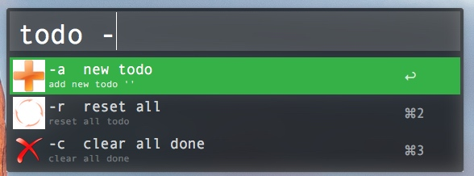
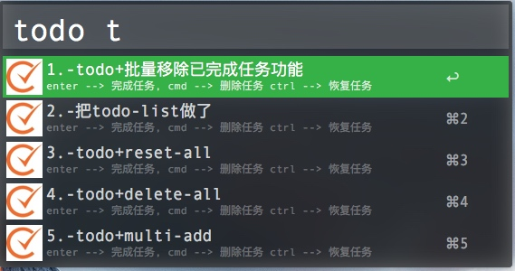

# Minimal-TODO
## 效果展示

## 介绍
这是一个极简todo list工具，todo任务文件放在指定的路径中。
在右侧的"path"对应的值中输入数据文件路径，并且最好是简单地txt文件。例如"~/Documents/Alfred/todos/todo.txt"。

使用“todo”来出发程序，默认会列出添加的todo，“-”开头意味着已经完成的todo。
可以使用的命令列表如下：

- "todo -c"  --> clear all done功能，清除所以已完成项；
- "todo -a"  --> 添加任务，支持一次添加多个，使用空格分割；
- "todo -r"  --> reset all 重置所有任务为未完成状态。

## 必要设置
`Minimal-TODO`插件的默认路径推荐设置为`~/Documents/Alfred/todos/todo.txt`。你也可以根据需要进行设置，设置方法如下。

